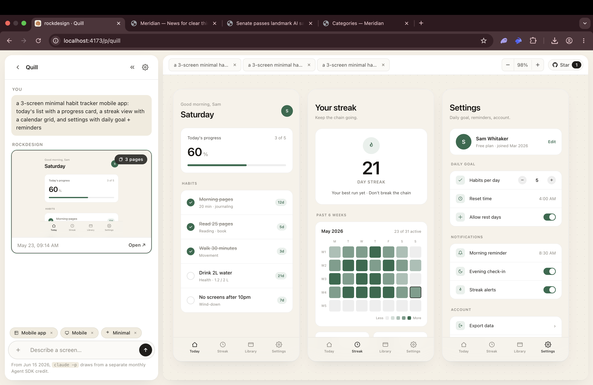
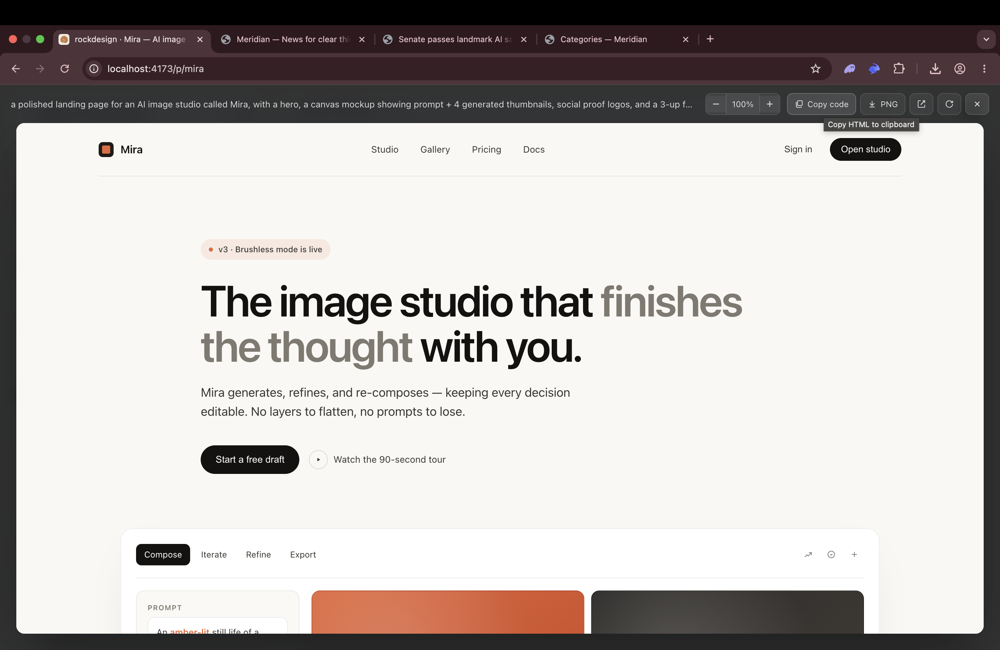
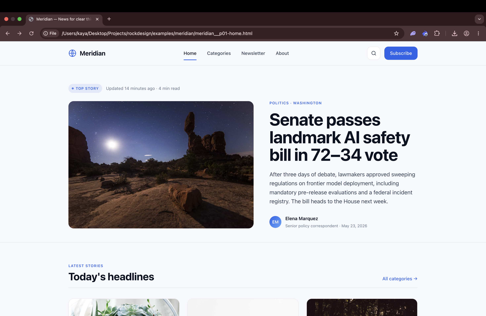

<div align="center">

# rockdesign

**A local-first design generator. Describe a UI in plain English and rockdesign
spins up a self-contained HTML mockup — driven by Claude Code under the hood,
guided by an opinionated, editable design system.**

[](https://github.com/utkurock/rockdesign)
[](https://docs.claude.com/claude-code)
[](https://nodejs.org/)
[](#security-model)

[Features](#what-it-does) · [How it works](#how-it-works) · [Install](#install--run) · [API](#api) · [Security](#security-model)

<br />



<sub>Quill — one of the bundled examples. Chat on the left, all generated pages on the board.</sub>

</div>

---

## What it does

- **Chat-style prompt** for new designs ("a settings page for a calendar app",
  "pricing section in a brutalist style", etc.).
- **Model picker** in the UI — pick **Sonnet** for fast iterations (default) or
  **Opus** when you want the best quality. Opus automatically falls back to
  Sonnet if it's unavailable.
- **Context controls** for project type, target platform (mobile / tablet /
  desktop / responsive), and style direction (liquid glass / minimal /
  brutalist / editorial).
- **Attachments** as design references: drop in images, Figma files, snapshot a
  public web page by URL, or point at a local code directory / GitHub repo for
  Claude to read from.
- **Single-file HTML output** — every generation is one inline-CSS/JS `.html`
  file, no external dependencies, viewable in any browser.
- **Editable design system** at `generations/CLAUDE.md` — the contract every
  design must follow. Tweak it from the UI to steer Claude's taste.
- **PNG export** via headless Chrome / Chromium, with adjustable viewport.
- **Persistent gallery** of past generations, stored in `db.json`, browsable
  and re-openable.

## What it produces

Every generation is a complete, self-contained HTML page you can open in any
browser. Two of the bundled examples, side by side:

<table>
  <tr>
    <td width="50%" valign="top">
      
      <p align="center"><sub><b>Mira</b> · marketing landing, editorial style</sub></p>
    </td>
    <td width="50%" valign="top">
      
      <p align="center"><sub><b>Meridian</b> · news app article, minimal web</sub></p>
    </td>
  </tr>
</table>

Three sample projects (Quill, Mira, Meridian) are seeded on first boot so
there's something to look at before you generate anything yourself.

## How it works

```
Browser UI (public/)
   │  prompt + context + attachments
   ▼
Express server (server.js)
   │  spawn `claude -p "<instruction>" --allowedTools Write,Read`
   ▼
Claude Code CLI
   │  reads CLAUDE.md, writes generations/gen_*.html
   ▼
Server returns the generation record → UI renders preview + PNG button
```

Each generation lives at `generations/<id>.html` and is served at
`/preview/<id>` (live HTML) and `/api/png/<id>?w=1280&h=800` (PNG via headless
Chrome).

## Requirements

- **Node.js 18+** (uses native `fetch`)
- **Claude Code CLI** installed and authenticated — `claude` must be on PATH.
  See <https://docs.claude.com/claude-code>.
- **Google Chrome / Chromium** (only required for PNG export)

## Install & run

### 1. Verify prerequisites

```bash
node --version    # v18+
claude --version  # Claude Code CLI
```

If either is missing, install [Node 18+](https://nodejs.org/) and the
[Claude Code CLI](https://docs.claude.com/claude-code) first.

### 2. Clone & install

```bash
git clone https://github.com/utkurock/rockdesign.git
cd rockdesign
npm install
```

### 3. Authenticate Claude Code

```bash
claude  # one-time login, then exit
```

rockdesign shells out to the `claude` CLI for every generation, so it has to be
logged in on your machine.

### 4. Start the server

```bash
npm start
# → rockdesign ready → http://localhost:4173
```

Override the port with `PORT=5000 npm start`.

### 5. Open the app

Visit <http://localhost:4173>. Three sample projects (Quill, Mira, Meridian)
are seeded on first boot so there's something to look at before you generate
anything yourself. Use the model dropdown in the chat to switch between
**Sonnet** (fast, default) and **Opus** (higher quality).

## Project layout

```
server.js              Express server + Claude bridge
public/                Frontend (index.html, app.js, style.css)
generations/           Generated HTML files + design-system contract
  CLAUDE.md            The design system Claude follows on every generation
  _attachments/        Uploaded references (images, .fig, fetched web pages)
db.json                Generation history (id, prompt, file, context, cost)
```

## API

| Method | Path                  | Purpose                                                 |
| ------ | --------------------- | ------------------------------------------------------- |
| GET    | `/api/generations`    | List past generations (newest first)                    |
| POST   | `/api/generate`       | Run a generation with `{ prompt, context, attachments }`|
| POST   | `/api/upload`         | Upload an attachment as base64                          |
| POST   | `/api/grab-web`       | Snapshot a public URL into an attachment                |
| POST   | `/api/check-path`     | Validate a local code path before linking it            |
| GET/PUT| `/api/design-system`  | Read / replace `generations/CLAUDE.md`                  |
| GET    | `/preview/:id`        | Render a generation as live HTML                        |
| GET    | `/api/raw/:id`        | View a generation's HTML source                         |
| GET    | `/api/png/:id`        | Export a generation as PNG (headless Chrome)            |

## Limits

- Upload: 120 MB per file, JSON body capped at 200 MB.
- Web snapshot: 5 MB page size, 15 s fetch timeout, public hosts only.
- Generation: 180 s Claude timeout, 4000-char prompt cap.

## Security model

rockdesign is intentionally a single-user local tool. The server hardens the
local boundary so you can run it on a shared Wi-Fi without leaking files:

- **Loopback-only bind.** Listens on `127.0.0.1` by default — other machines on
  your LAN cannot reach it. Override with `HOST=0.0.0.0` only if you know what
  you're doing.
- **Same-origin enforcement.** `/api/*` rejects requests with a `Host` header
  or `Origin` that isn't this server (defeats DNS-rebinding attacks).
- **Path probe is jailed.** `/api/check-path` resolves symlinks first and
  refuses anything outside `$HOME`, plus a denylist (`.ssh`, `.aws`, `.gnupg`,
  keychains, browser profiles, etc.).
- **Generated previews are sandboxed.** `/preview/:id` is served with a strict
  Content-Security-Policy (`connect-src 'none'`, etc.) and the UI iframes use
  `sandbox="allow-scripts"` (unique opaque origin → cannot call the API or
  read the parent DOM).
- **Hardened SSRF for web grab.** `/api/grab-web` resolves the hostname,
  rejects any private/loopback/CGNAT/link-local/metadata IP (IPv4 + IPv6), and
  refuses redirects.
- **Claude tool surface is locked.** Only `Write` and `Read` are exposed, and
  the system instruction explicitly forbids reading anything outside
  `generations/`, the listed attachment paths, and the linked local code
  directory.
- **No telemetry.** The only outbound traffic is (a) `claude-code` talking to
  the Anthropic API on your behalf, and (b) `/api/grab-web` fetching the URLs
  you explicitly paste in. Nothing else leaves the box.

If you intentionally want to expose this beyond your laptop, put a reverse
proxy with real authentication in front of it — there is no built-in auth.
